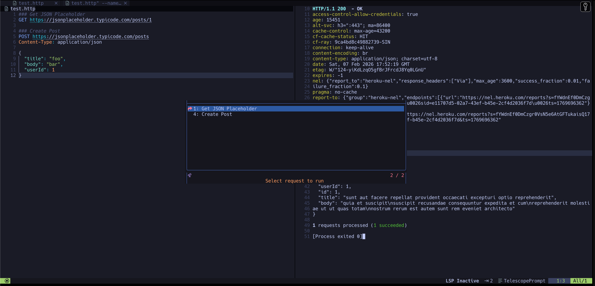

# httpyac.nvim

Neovim plugin for running HTTP requests from `.http` files using httpyac.



## Requirements

- Neovim >= 0.8.0
- [httpyac](https://httpyac.github.io/) - Install with `npm install -g httpyac`

## Installation

### Using lazy.nvim (LunarVim)
```lua
{
  "yourusername/httpyac.nvim",
  ft = "http",
  config = function()
    require("httpyac").setup({
      split_direction = "vertical", -- vertical, horizontal
      output_type = "terminal", -- terminal, buffer
    })
  end
}
```

### Using packer.nvim
```lua
use {
  'yourusername/httpyac.nvim',
  ft = 'http',
  config = function()
    require('httpyac').setup()
  end
}
```

### Using vim-plug
```vim
Plug 'yourusername/httpyac.nvim'
```

## Usage

Create a `.http` file:
```http
### Get Users
GET https://api.example.com/users
Authorization: Bearer token123

### Create User
POST https://api.example.com/users
Content-Type: application/json

{
  "name": "John",
  "email": "john@example.com"
}
```

## Keybindings

Default keybindings for `.http` files:

- `<leader>hr` - Run request at cursor (terminal output)
- `<leader>hb` - Run request at cursor (buffer output)
- `<leader>ha` - Run all requests
- `<leader>hl` - List all requests and select
- `<C-j>` - Quick run request at cursor

## Configuration
```lua
require("httpyac").setup({
  split_direction = "vertical", -- "vertical" or "horizontal"
  output_type = "terminal",     -- "terminal" or "buffer"
})
```

## Features

- ✅ Run individual HTTP requests
- ✅ Run all requests in file
- ✅ List and select requests
- ✅ Terminal or buffer output
- ✅ Auto-detect request blocks
- ✅ Support all httpyac features

## License

MIT
